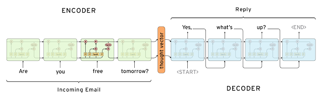

# Seq2Seq chatbot


This is tensorflow/tensorlayer implementation of Twitter/Cornell-Movie corpus ChatBot.

### Prerequisites
- python 3.5.2
- tensorflow 1.8.0
- tensorlayer 1.9.0
- numpy 1.14.5

### Datasets
[Cornell Movie Dialogs Corpus](https://github.com/suriyadeepan/datasets/tree/master/seq2seq/cornell_movie_corpus)

[Twitter Chat log](https://github.com/suriyadeepan/datasets/tree/master/seq2seq/twitter
)
### Generative Model


### Usage
- Train your own model: use ```python3 chatbot_train.py <datasets> <num_epoch>```
```
$ python3 chatbot_train.py cornell_corpus 350
2018-07-16 18:52:49.880041: I tensorflow/core/common_runtime/gpu/gpu_device.cc:1356] Found device 0 with properties: 
name: Quadro P6000 major: 6 minor: 1 memoryClockRate(GHz): 1.645
pciBusID: 0000:05:00.0
totalMemory: 23.87GiB freeMemory: 23.36GiB
2018-07-16 18:52:49.880098: I tensorflow/core/common_runtime/gpu/gpu_device.cc:1435] Adding visible gpu devices: 0
2018-07-16 18:52:50.172991: I tensorflow/core/common_runtime/gpu/gpu_device.cc:923] Device interconnect StreamExecutor with strength 1 edge matrix:
2018-07-16 18:52:50.173052: I tensorflow/core/common_runtime/gpu/gpu_device.cc:929]      0 
2018-07-16 18:52:50.173069: I tensorflow/core/common_runtime/gpu/gpu_device.cc:942] 0:   N 
2018-07-16 18:52:50.173690: I tensorflow/core/common_runtime/gpu/gpu_device.cc:1053] Created TensorFlow device (/job:localhost/replica:0/task:0/device:GPU:0 with 22668 MB memory) -> physical GPU (device: 0, name: Quadro P6000, pci bus id: 0000:05:00.0, compute capability: 6.1)
Restoring model parameters successful
Epoch: 350/350 --Step: 178/178 -- loss: 127.4898681641 -- Speed: 1.518 batches/second
```
- Inference: use ```python3 chatbot_inference.py ```
```
$ python3 chatbot_inference.py 
2018-07-17 10:21:08.682161: I tensorflow/core/common_runtime/gpu/gpu_device.cc:1356] Found device 0 with properties: 
name: Quadro P6000 major: 6 minor: 1 memoryClockRate(GHz): 1.645
pciBusID: 0000:05:00.0
totalMemory: 23.87GiB freeMemory: 23.36GiB
2018-07-17 10:21:08.682218: I tensorflow/core/common_runtime/gpu/gpu_device.cc:1435] Adding visible gpu devices: 0
2018-07-17 10:21:08.991306: I tensorflow/core/common_runtime/gpu/gpu_device.cc:923] Device interconnect StreamExecutor with strength 1 edge matrix:
2018-07-17 10:21:08.991370: I tensorflow/core/common_runtime/gpu/gpu_device.cc:929]      0 
2018-07-17 10:21:08.991385: I tensorflow/core/common_runtime/gpu/gpu_device.cc:942] 0:   N 
2018-07-17 10:21:08.992010: I tensorflow/core/common_runtime/gpu/gpu_device.cc:1053] Created TensorFlow device (/job:localhost/replica:0/task:0/device:GPU:0 with 22676 MB memory) -> physical GPU (device: 0, name: Quadro P6000, pci bus id: 0000:05:00.0, compute capability: 6.1)
Model successfully restored, chatbot ready to chat!

Query   >
```

### Conversation Example
```
Query   >  will you give us a chance to live
Respone >  of course not

Query   >  i am angry
Respone >  you should be more careful 

Query   >  never let go
Respone >  i promise i will never let go jack ill never let go 

Query   >  are you talking to me
Respone >  yes sir 

Query   >  ill be back
Respone >  where are you going 

Query   >  do you fear being with me
Respone >  not really 
```

### References
[Deep Learning for Chatbots](http://www.wildml.com/2016/04/deep-learning-for-chatbots-part-1-introduction/)

[Neural Machine Translation (seq2seq) Tutorial](https://github.com/tensorflow/nmt)

[seq2seq-chatbot](https://github.com/tensorlayer/seq2seq-chatbot)

[Practical seq2seq](http://suriyadeepan.github.io/2016-12-31-practical-seq2seq/)

[Understanding LSTM Networks](http://colah.github.io/posts/2015-08-Understanding-LSTMs/)

[The Unreasonable Effectiveness of Recurrent Neural Networks](http://karpathy.github.io/2015/05/21/rnn-effectiveness/)